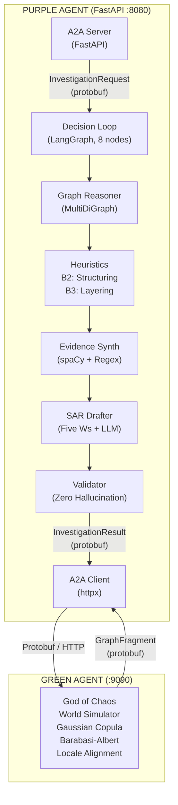
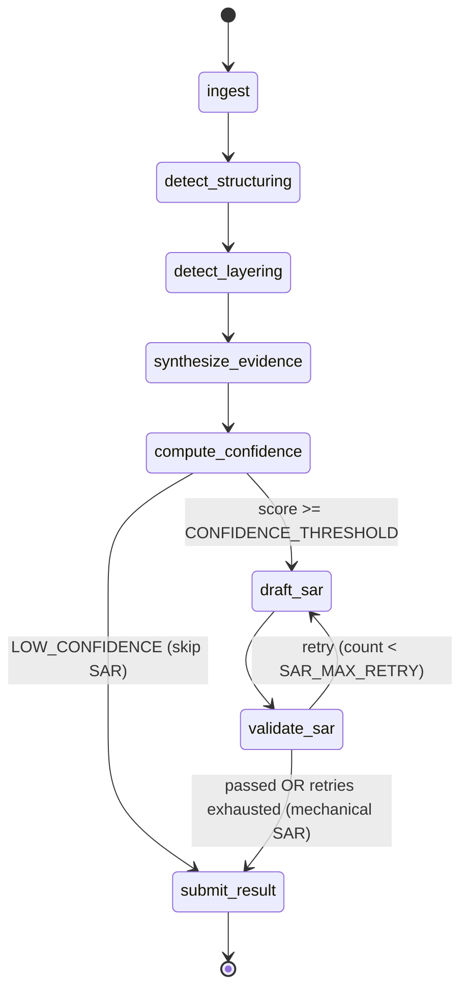
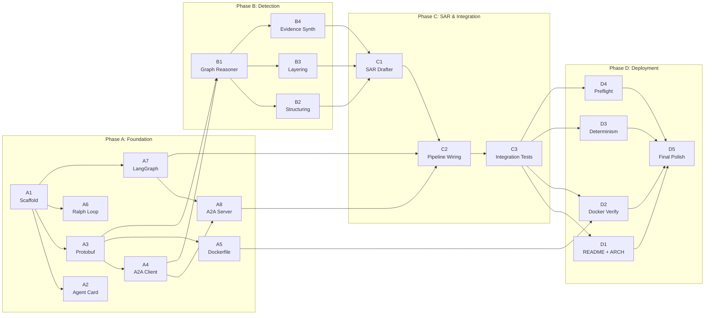

# Purple Agent -- Architecture Document

> **Project Gamma | The Panopticon Protocol**
> **Spec Version:** v11.0 (`.cursorrules` definitive -- all v6.x through v10.x defects pre-resolved)
> **Agent Version:** 7.0.0 (`config.py` / `agent.json`)
> **Competition:** AgentX-AgentBeats Finance Track
> **Python:** 3.11+ required (`X | None` union syntax, `tomllib`, etc.)

---

## Table of Contents

1. [Mission and Zero-Failure Mandate](#1-mission-and-zero-failure-mandate)
2. [System Architecture](#2-system-architecture)
3. [LangGraph Decision Loop](#3-langgraph-decision-loop)
4. [Data Flow](#4-data-flow)
5. [InvestigationState TypedDict](#5-investigationstate-typeddict)
6. [File Structure](#6-file-structure)
7. [Protobuf Contract](#7-protobuf-contract)
8. [Configuration Constants (SSOT)](#8-configuration-constants-ssot)
9. [Dual Jurisdiction Support](#9-dual-jurisdiction-support)
10. [Determinism Guarantees](#10-determinism-guarantees)
11. [28 Critical Rules](#11-28-critical-rules)
12. [23 Anti-Patterns](#12-23-anti-patterns)
13. [Testing Standards](#13-testing-standards)
14. [Error Handling Taxonomy](#14-error-handling-taxonomy)
15. [Docker and Deployment](#15-docker-and-deployment)
16. [Task Dependency Chain](#16-task-dependency-chain)

---

## 1. Mission and Zero-Failure Mandate

**Status:** Green Agent (Phase 1, data generator) COMPLETE. Purple Agent IN PROGRESS.

Purple Agent is an autonomous forensic financial crime investigator that:

1. Serves an A2A endpoint (FastAPI `:8080`) to receive investigation requests
2. Fetches data from Green Agent (`:9090`) via A2A/Protobuf (binary payloads)
3. Traverses financial graphs using NetworkX `MultiDiGraph` (BFS + iterative DFS)
4. Detects **Structuring** (fan-in \$9K--\$9.8K USD / 9L--9.8L INR) and **Layering** (2--5% decay chains)
5. Synthesizes unstructured text evidence using spaCy NER + regex (ledger = ground truth)
6. Drafts **FinCEN SAR** + **FIU-IND STR** narratives with Five Ws (Who/What/Where/When/Why)
7. Computes `confidence_score` and gates SAR filing on `CONFIDENCE_THRESHOLD`
8. Achieves **100% entity recall**, **zero hallucinations**, **deterministic outputs**

### Zero-Failure Mandate

Hallucinations ARE regulatory violations. Regulatory violations ARE build failures.
A hallucinated entity, amount, or transaction ID in a SAR narrative is equivalent to
filing a fraudulent regulatory report. There is NO acceptable hallucination rate.
The target is **ZERO**.

### Success Metrics

| Metric | Target |
|--------|--------|
| Entity recall on criminal node detection | 100% |
| SAR regulatory compliance (FinCEN + FIU-IND) | Perfect |
| Byte-identical results across 10 runs | Required |
| Hallucinated references in any SAR narrative | Zero |

---

## 2. System Architecture



---

## 3. LangGraph Decision Loop

The decision loop consists of **8 nodes** connected by conditional edges:



**Node descriptions:**

| Node | Responsibility |
|------|---------------|
| `ingest` | Parse InvestigationRequest, fetch GraphFragment, build MultiDiGraph |
| `detect_structuring` | Fan-in BFS detection within currency-grouped threshold bands |
| `detect_layering` | Chain DFS with decay rate analysis (iterative, stack-based) |
| `synthesize_evidence` | Cross-reference text evidence with ledger via spaCy NER + regex |
| `compute_confidence` | Score computation BEFORE SAR generation; gate on threshold |
| `draft_sar` | LLM Five Ws narrative with prompt injection sanitization |
| `validate_sar` | Verify every cited entity/amount/timestamp exists in graph |
| `submit_result` | A2A submission with idempotency key and custom JSON encoder |

**Conditional edges:**

- `compute_confidence` --> `submit_result`: When `confidence_score < CONFIDENCE_THRESHOLD` (default 0.5), set typology to `NONE`, skip SAR, return `LOW_CONFIDENCE` result.
- `validate_sar` --> `draft_sar`: When validation fails and `retry_count < SAR_MAX_RETRY`, retry.
- `validate_sar` --> `submit_result`: When validation passes, OR when `retry_count >= SAR_MAX_RETRY` (generate mechanical SAR from f-string template -- NEVER submit empty/malformed SAR).

---

## 4. Data Flow

Each investigation follows these steps:

### Step 1: Receive Request

Green Agent sends `InvestigationRequest` (protobuf) to Purple `:8080`.
Contains: `subject_id`, `case_id`, `hop_depth`, `jurisdiction`.

### Step 2: Fetch Graph

Purple's A2A Client fetches `GraphFragment` from Green `:9090`.
On fetch failure: `raise ValueError` -- NEVER proceed with empty graph.
An empty graph produces false negatives (clearing criminals), which is worse than a crash.

### Step 2.5: GraphFragment Validation

- **REJECT** if `len(transactions) == 0` (`raise ValueError` -- same as fetch failure)
- **GUARD** duplicate transaction IDs: keep FIRST occurrence, log warning (never silently overwrite)
- **VALIDATE** all amounts: `Decimal(str(tx.amount)).is_finite()` (reject NaN/Infinity)
- **VALIDATE** currency field is non-empty for every transaction
- **VALIDATE** timestamps > 0 (warn, do not reject -- defensive pattern)
- **LOG** but DO NOT REJECT self-loops (`source_node == target_node`) -- these represent intra-bank transfers that may be part of legitimate or layering flows

### Step 3: Protobuf to Python

`_protobuf_to_dict` converts proto messages to Python dicts with Decimal amounts:

- `Decimal(str(tx.amount))` -- preserves full proto `double` precision
- Do NOT quantize at ingestion. Preserve precision for arithmetic.
- Quantize ONLY when comparing against thresholds or formatting SAR amounts.
- NaN/Infinity validation: reject any amount where `not amount.is_finite()`
- Extracts: `transactions`, `nodes`, `text_evidence`, `ground_truth_criminals`

### Step 4: Graph Reasoning

`GraphReasoner` builds `MultiDiGraph`, runs BFS (structuring) + DFS (layering):

- `hop_depth` from request flows into DFS `max_depth` parameter
- DFS is **iterative** (stack-based), NOT recursive -- prevents stack overflow
- Super-node protection: skip nodes with degree > `MAX_NODE_DEGREE` (log warning)
- Path explosion limit: stop after `MAX_PATHS_PER_SEARCH` chains collected
- Currency grouped: USD vs INR thresholds applied separately
- All set/dict iteration uses `sorted()` for determinism

### Step 5: Evidence Synthesis

`EvidenceSynthesizer` cross-references text evidence with ledger data:

- spaCy NER (lazy-loaded, not module-level) extracts PERSON, ORG, GPE, MONEY, DATE
- Regex extracts IFSC, PAN, SWIFT, IBAN, account refs, amount patterns
- Amount deduplication: a string like "\$10,000 USD" yields one Decimal, not two
- Discrepancy check: `|text_amount - ledger_amount| > EVIDENCE_DISCREPANCY_THRESHOLD`
- Zero-value handling: check `ledger_amount is not None` (not `> 0`), to catch zero-ledger fraud
- Discrepancy between text amount and ledger amount = **EVIDENCE**, not error

### Step 6: Confidence Scoring

Computed **BEFORE** SAR generation:

| Component | Value | Condition |
|-----------|-------|-----------|
| Base | 0.3 | One typology detected (structuring OR layering) |
| Base | 0.6 | BOTH typologies detected |
| Evidence boost | +0.2 | Text evidence corroborates detection |
| Discrepancy boost | +0.2 | `SUSPICIOUS_DISCREPANCY` found |

Formula: `score = min(1.0, base + evidence_boost + discrepancy_boost)`

Range: \[0.0, 1.0\], clamped via `min()`. Type is `float` (NOT `Decimal` -- it is a probability, not currency).

**IEEE 754 safety:** 0.3 + 0.2 = 0.5 exactly; 0.6 + 0.2 = 0.8 exactly; 0.3 + 0.2 + 0.2 = 0.7 exactly.

**Gate:** If `score < CONFIDENCE_THRESHOLD` (default 0.5), set typology to `NONE`, skip SAR, return `LOW_CONFIDENCE` result.

### Step 7: SAR Drafting

`SARDrafter` generates Five Ws narrative via LLM:

- Prompt injection sanitized: all data enclosed in `<data>` delimiters
- LLM seed parameter (`SAR_LLM_SEED`) for deterministic output
- Narrative length capped at `SAR_MAX_NARRATIVE_CHARS`
- Timezone-aware date formatting: FinCEN=UTC, FIU-IND=Asia/Kolkata
- On retry exhaustion (`retry_count >= SAR_MAX_RETRY`): generate **mechanical SAR** from f-string template. NEVER submit empty/malformed SAR.
- Validator checks every cited entity/amount/timestamp exists in graph
- Zero tolerance: any hallucinated reference = retry or mechanical fallback

### Step 8: Submission

A2A Client submits `InvestigationResult` to Green Agent:

- Idempotency key: `SHA-256(case_id + typology + sorted(involved_entities))`
- `investigation_timestamp` set to `int(time.time())` at submit moment
- Custom JSON encoder for Decimal: converts to `str()` in JSON responses

---

## 5. InvestigationState TypedDict

`InvestigationState` is the single typed state dict flowing through LangGraph.
Every node in the decision loop reads from and writes to this state.

```python
class InvestigationState(TypedDict):
    case_id: str                         # Unique investigation identifier
    subject_id: str                      # Entry point node ID
    jurisdiction: str                    # "fincen" or "fiu_ind"
    hop_depth: int                       # From InvestigationRequest, flows to DFS max_depth
    graph_fragment: dict | None          # Deserialized GraphFragment
    graph: nx.MultiDiGraph               # Built from protobuf GraphFragment
    transactions: list[dict]             # Raw transaction dicts (Decimal amounts)
    nodes: dict[str, dict]               # Node attributes by ID
    text_evidence: list[dict]            # Unstructured evidence documents
    ground_truth_criminals: list[str]    # For recall computation ONLY (not used in detection)
    structuring_results: list[dict]      # From B2 heuristic
    layering_results: list[dict]         # From B3 heuristic
    evidence_results: list[dict]         # From B4 evidence synthesizer
    detected_typology: str | None        # STRUCTURING | LAYERING | BOTH | NONE
    detection_results: dict | None       # Aggregated detection output
    evidence_package: dict | None        # Synthesized evidence
    sar_narrative: str                   # Five Ws narrative text
    sar_draft: dict | None               # Serialized SARDraft
    validation_result: dict | None       # SAR validation outcome
    typology_detected: str               # Final typology string
    involved_entities: list[str]         # ALL detected criminal nodes (SORTED)
    confidence_score: float              # Computed in step 6 (float, NOT Decimal)
    investigation_timestamp: int         # Set at submit: int(time.time())
    retry_count: int                     # SAR validation retry counter
    status: str                          # "PENDING" | "IN_PROGRESS" | "COMPLETE" | "FAILED"
    error_message: str | None            # Set on failure, None otherwise
```

---

## 6. File Structure

Files marked with **[EXISTS]** are present in the repository. Files marked with
**[TARGET]** are specified by the architecture but not yet created.

```
purple_agent/
+-- agent.json                    [EXISTS]  A2A agent card (capabilities, endpoints)
+-- scenario.toml                 [EXISTS]  Competition scenario config
+-- Dockerfile                    [EXISTS]  Container definition (requires upgrade to spec)
+-- .dockerignore                 [EXISTS]  Excludes .git, tests, .env, scripts/
+-- requirements.txt              [EXISTS]  Pinned deps (NO >= ranges)
+-- pyproject.toml                [EXISTS]  pytest: asyncio_mode=auto, pythonpath=["."]
+-- ralph.sh                      [EXISTS]  Die-and-restart loop (NO set -e)
+-- prompt.md                     [TARGET]  LLM system prompt for SAR generation
+-- README.md                     [TARGET]  Project overview and quick start
+-- ARCHITECTURE.md               [EXISTS]  This document
+-- .env.example                  [EXISTS]  All env vars with PYTHONHASHSEED=0
+-- .gitignore                    [EXISTS]  Does NOT exclude protos/*_pb2.py
+-- protos/
|   +-- __init__.py               [EXISTS]  Package marker (BUG-02 fix)
|   +-- financial_crime.proto     [EXISTS]  7 message types (FROZEN -- shared with Green)
|   +-- financial_crime_pb2.py    [TARGET]  Generated bindings (committed, not gitignored)
+-- plans/
|   +-- prd.json                  [TARGET]  20 tasks with dependencies (A1-D5)
+-- progress.txt                  [TARGET]  Ralph Wiggum iteration log
+-- scripts/
|   +-- preflight.sh              [EXISTS]  Pre-deployment validation (chmod +x)
+-- src/
|   +-- __init__.py               [EXISTS]  Package marker
|   +-- main.py                   [EXISTS]  Entry: load_dotenv -> RedactingFormatter -> uvicorn
|   +-- config.py                 [EXISTS]  SINGLE SOURCE OF TRUTH for all constants
|   +-- baseline_agent.py         [EXISTS]  Minimal viable baseline investigator
|   +-- ralph_runner.py           [TARGET]  Per-iteration task executor
|   +-- core/
|       +-- __init__.py           [EXISTS]  Package marker
|       +-- a2a_client.py         [TARGET]  httpx + circuit breaker + retry + protobuf
|       +-- a2a_server.py         [TARGET]  FastAPI endpoints (/a2a, /health)
|       +-- decision_loop.py      [TARGET]  LangGraph state machine (8 nodes)
|       +-- graph_reasoner.py     [TARGET]  MultiDiGraph + BFS + iterative DFS
|       +-- evidence_synthesizer.py [TARGET] spaCy NER + regex
|       +-- sar_drafter.py        [TARGET]  LLM Five Ws + mechanical fallback
|       +-- heuristics/
|           +-- __init__.py       [TARGET]  Package marker
|           +-- structuring.py    [TARGET]  Fan-in BFS detection
|           +-- layering.py       [TARGET]  Chain DFS with decay analysis
+-- tests/
    +-- __init__.py               [EXISTS]  Package marker
    +-- conftest.py               [TARGET]  16 shared fixtures (ground truth data)
    +-- test_agent_card_schema.py  [TARGET]
    +-- test_protobuf_serialization.py [TARGET]
    +-- test_a2a_client.py        [TARGET]  27 tests
    +-- test_a2a_server.py        [TARGET]
    +-- test_graph_reasoner_core.py [TARGET]
    +-- test_structuring_detection.py [TARGET]
    +-- test_layering_detection.py [TARGET]
    +-- test_evidence_synthesizer.py [TARGET]
    +-- test_sar_drafter.py       [TARGET]
    +-- test_decision_loop.py     [TARGET]
    +-- integration/
        +-- __init__.py           [TARGET]
        +-- test_full_pipeline.py [TARGET]
        +-- test_zero_failure.py  [TARGET]
```

---

## 7. Protobuf Contract

`financial_crime.proto` defines 7 message types for A2A communication.
This proto is **SHARED** with Green Agent (Phase 1, COMPLETE).
The schema is **FROZEN** -- changes would break the Green Agent contract.

**KEY CONSTRAINT:** `Transaction.amount` is `double` in proto. Python code MUST
convert at the boundary: `Decimal(str(proto_tx.amount))`. Do NOT use
`Decimal(proto_tx.amount)` -- that converts from float, not string.

### Message Types

**Transaction**

| Field | Type | Notes |
|-------|------|-------|
| `id` | `string` | Unique transaction identifier |
| `source_node` | `string` | Sender node ID |
| `target_node` | `string` | Receiver node ID |
| `amount` | `double` | FROZEN -- convert via `Decimal(str())` in Python |
| `currency` | `string` | "USD", "INR", etc. |
| `timestamp` | `int64` | Unix epoch seconds |
| `type` | `string` | "WIRE", "ACH", "CASH_DEPOSIT", "RTGS", "NEFT" |
| `reference` | `string` | Transaction reference code |
| `branch_code` | `string` | Originating branch identifier |

**NodeAttributes**

| Field | Type | Notes |
|-------|------|-------|
| `id` | `string` | Node identifier |
| `name` | `string` | Entity display name |
| `entity_type` | `string` | "individual", "business", "bank", "government" |
| `jurisdiction` | `string` | ISO country code: "US", "IN", "DE" |
| `account_id` | `string` | Financial account identifier |
| `ifsc_code` | `string` | Indian Financial System Code |
| `pan_number` | `string` | Permanent Account Number (India) |
| `address` | `string` | Entity address |
| `risk_rating` | `string` | "low", "medium", "high", "pep" |
| `swift_code` | `string` | SWIFT/BIC code |

**TextEvidence**

| Field | Type | Notes |
|-------|------|-------|
| `id` | `string` | Evidence document identifier |
| `source_type` | `string` | "email", "memo", "sar_draft", "teller_note" |
| `content` | `string` | Raw text content |
| `associated_entity` | `string` | Linked entity ID |
| `timestamp` | `int64` | Document creation timestamp |

**GraphFragment**

| Field | Type | Notes |
|-------|------|-------|
| `scenario_id` | `string` | Scenario identifier |
| `generated_at` | `int64` | Generation timestamp |
| `transactions` | `repeated Transaction` | All transactions in the fragment |
| `nodes` | `map<string, NodeAttributes>` | Node attributes keyed by ID |
| `text_evidence` | `repeated TextEvidence` | Unstructured evidence documents |
| `ground_truth_criminals` | `repeated string` | For evaluation only |

**InvestigationRequest**

| Field | Type | Notes |
|-------|------|-------|
| `subject_id` | `string` | Entry point node to investigate |
| `alert_timestamp` | `int64` | When the alert was triggered |
| `case_id` | `string` | Unique case identifier |
| `hop_depth` | `int32` | Flows into DFS `max_depth` |
| `jurisdiction` | `string` | "fincen" or "fiu_ind" |

**CitedEvidence**

| Field | Type | Notes |
|-------|------|-------|
| `transaction_id` | `string` | Referenced transaction |
| `amount` | `double` | Transaction amount |
| `relevance` | `string` | Why this evidence matters |
| `timestamp` | `int64` | Transaction timestamp |

**InvestigationResult**

| Field | Type | Notes |
|-------|------|-------|
| `case_id` | `string` | Matches request `case_id` |
| `sar_narrative` | `string` | Five Ws narrative text |
| `typology_detected` | `string` | "STRUCTURING", "LAYERING", "BOTH", "NONE" |
| `involved_entities` | `repeated string` | All detected criminal nodes (sorted) |
| `cited_evidence` | `repeated CitedEvidence` | Supporting evidence references |
| `confidence_score` | `double` | Computed, not defaulted |
| `jurisdiction` | `string` | "fincen" or "fiu_ind" |
| `investigation_timestamp` | `int64` | Set at submit time |

---

## 8. Configuration Constants (SSOT)

`src/config.py` is the **SINGLE SOURCE OF TRUTH** for all thresholds, timeouts,
regex patterns, and magic numbers. Every implementation file imports from here.
All values are overridable via `os.getenv()` with Decimal-safe defaults.

### Structuring Detection -- USD

| Constant | Default | Env Var | Description |
|----------|---------|---------|-------------|
| `STRUCTURING_MIN_AMOUNT_USD` | `Decimal("9000")` | `STRUCTURING_MIN_USD` | Lower structuring band |
| `STRUCTURING_MAX_AMOUNT_USD` | `Decimal("9800")` | `STRUCTURING_MAX_USD` | Upper band (NOT \$9,999.99) |
| `CTR_THRESHOLD_USD` | `Decimal("10000")` | `CTR_THRESHOLD_USD` | Currency Transaction Report |
| `STRUCTURING_MIN_COUNT` | `10` | `STRUCTURING_MIN_COUNT` | Min transactions in band |
| `STRUCTURING_TIME_WINDOW_SECONDS` | `172800` | `STRUCTURING_TIME_WINDOW` | 48 hours |
| `VELOCITY_THRESHOLD` | `Decimal("5000")` | `VELOCITY_THRESHOLD` | Velocity anomaly threshold |

### Structuring Detection -- INR (PMLA)

| Constant | Default | Env Var | Description |
|----------|---------|---------|-------------|
| `STRUCTURING_MIN_AMOUNT_INR` | `Decimal("900000")` | `STRUCTURING_MIN_INR` | 9 lakh |
| `STRUCTURING_MAX_AMOUNT_INR` | `Decimal("980000")` | `STRUCTURING_MAX_INR` | 9.8 lakh |
| `CTR_THRESHOLD_INR` | `Decimal("1000000")` | `CTR_THRESHOLD_INR` | 10 lakh |
| `STRUCTURING_MIN_COUNT_INR` | `10` | `STRUCTURING_MIN_COUNT_INR` | Min transactions in band |
| `STRUCTURING_TIME_WINDOW_SECONDS_INR` | `172800` | `STRUCTURING_TIME_WINDOW_INR` | 48 hours |

### Layering Detection

| Constant | Default | Env Var | Description |
|----------|---------|---------|-------------|
| `MIN_CHAIN_LENGTH` | `3` | `MIN_CHAIN_LENGTH` | Minimum hops (not nodes) |
| `MAX_DFS_DEPTH` | `15` | `MAX_DFS_DEPTH` | DFS traversal limit |
| `DECAY_RATE_MIN` | `Decimal("0.02")` | `DECAY_RATE_MIN` | 2% minimum decay |
| `DECAY_RATE_MAX` | `Decimal("0.05")` | `DECAY_RATE_MAX` | 5% maximum decay |
| `DECAY_TOLERANCE` | `Decimal("0.005")` | `DECAY_TOLERANCE` | Tolerance band |
| `MAX_HOP_DELAY_SECONDS` | `43200` | `MAX_HOP_DELAY` | 12 hours max between hops |

### Graph Safety

| Constant | Default | Env Var | Description |
|----------|---------|---------|-------------|
| `MAX_NODE_DEGREE` | `500` | `MAX_NODE_DEGREE` | Super-node skip threshold |
| `MAX_PATHS_PER_SEARCH` | `1000` | `MAX_PATHS_PER_SEARCH` | Path explosion circuit breaker |

### Confidence Scoring

| Constant | Default | Env Var | Description |
|----------|---------|---------|-------------|
| `CONFIDENCE_THRESHOLD` | `Decimal("0.5")` | `CONFIDENCE_THRESHOLD` | SAR filing gate |

### A2A Client -- Retry and Circuit Breaker

| Constant | Default | Env Var | Description |
|----------|---------|---------|-------------|
| `RETRY_MAX_ATTEMPTS` | `5` | `RETRY_MAX_ATTEMPTS` | Maximum retry attempts |
| `RETRY_BASE_DELAY_SECONDS` | `1.0` | `RETRY_BASE_DELAY` | Base delay for backoff |
| `JITTER_FACTOR` | `0.5` | `JITTER_FACTOR` | Random jitter multiplier |
| `CIRCUIT_BREAKER_FAILURE_THRESHOLD` | `0.6` | `CB_FAILURE_THRESHOLD` | Failure rate to trip breaker |
| `CIRCUIT_BREAKER_WINDOW_SECONDS` | `60` | `CB_WINDOW_SECONDS` | Sliding window duration |
| `REQUEST_TIMEOUT_SECONDS` | `30.0` | `REQUEST_TIMEOUT` | Per-request timeout |

Circuit breaker state machine:
`CLOSED` (normal) --> `OPEN` (tripped) --> `HALF_OPEN` (probe) --> `CLOSED` or `OPEN`.

### A2A Protocol

| Constant | Default | Env Var | Description |
|----------|---------|---------|-------------|
| `GREEN_AGENT_URL` | `"http://localhost:9090"` | `GREEN_AGENT_URL` | Green Agent base URL |
| `A2A_SERVER_HOST` | `"0.0.0.0"` | `A2A_SERVER_HOST` | Purple Agent bind host |
| `A2A_SERVER_PORT` | `8080` | `A2A_SERVER_PORT` | Purple Agent bind port |
| `PROTOBUF_CONTENT_TYPE` | `"application/x-protobuf"` | -- | Content type header |
| `JSON_CONTENT_TYPE` | `"application/json"` | -- | Content type header |

### SAR Generation

| Constant | Default | Env Var | Description |
|----------|---------|---------|-------------|
| `SAR_MAX_RETRY` | `3` | `SAR_MAX_RETRY` | Max SAR validation retries |
| `SAR_LLM_MODEL` | `"gpt-4o-mini"` | `SAR_LLM_MODEL` | LLM model identifier |
| `SAR_LLM_TEMPERATURE` | `0.0` | `SAR_LLM_TEMPERATURE` | Greedy decoding |
| `SAR_LLM_SEED` | `42` | `SAR_LLM_SEED` | Deterministic seed |
| `SAR_MAX_NARRATIVE_CHARS` | `10000` | `SAR_MAX_NARRATIVE_CHARS` | Narrative length cap |

### Evidence Synthesis

| Constant | Default | Env Var | Description |
|----------|---------|---------|-------------|
| `EVIDENCE_DISCREPANCY_THRESHOLD_USD` | `Decimal("100")` | `EVIDENCE_DISCREPANCY_USD` | USD discrepancy flag |
| `EVIDENCE_DISCREPANCY_THRESHOLD_INR` | `Decimal("10000")` | `EVIDENCE_DISCREPANCY_INR` | INR discrepancy flag |
| `SPACY_MODEL_NAME` | `"en_core_web_sm"` | `SPACY_MODEL` | spaCy model (66MB) |

### Regex Patterns

| Constant | Pattern | Description |
|----------|---------|-------------|
| `IFSC_REGEX` | `^[A-Z]{4}0[A-Z0-9]{6}$` | Indian Financial System Code |
| `PAN_REGEX` | `^[A-Z]{5}[0-9]{4}[A-Z]$` | Permanent Account Number |
| `SWIFT_REGEX` | `^[A-Z]{4}[A-Z]{2}[A-Z0-9]{2}([A-Z0-9]{3})?$` | SWIFT/BIC code |
| `IBAN_REGEX` | `^[A-Z]{2}[0-9]{2}[A-Z0-9]{4,}$` | International Bank Account Number |

Amount extraction patterns (`AMOUNT_PATTERNS` dict):
`usd_symbol`, `usd_k`, `currency_code`, `inr_symbol`, `inr_rs_prefix`, `inr_lakh`, `inr_crore`.

All identifier regexes have pre-compiled versions (`IFSC_COMPILED`, `PAN_COMPILED`, `SWIFT_COMPILED`, `IBAN_COMPILED`).

### Agent Identity

| Constant | Default | Description |
|----------|---------|-------------|
| `AGENT_VERSION` | `"7.0.0"` | Agent software version |
| `IDEMPOTENCY_HASH_ALGO` | `"sha256"` | Hash algorithm for dedup keys |

### Timezone

| Constant | Value | Description |
|----------|-------|-------------|
| `TIMEZONE_FINCEN` | `"UTC"` | FinCEN SAR filing timezone |
| `TIMEZONE_FIU_IND` | `"Asia/Kolkata"` | FIU-IND STR filing timezone (IST) |

### Ralph Wiggum Loop

| Constant | Default | Env Var | Description |
|----------|---------|---------|-------------|
| `COMPLETION_SIGNAL` | `"<promise>complete</promise>"` | -- | Task completion marker |
| `MAX_RALPH_ITERATIONS` | `25` | `MAX_RALPH_ITERATIONS` | Max loop iterations |
| `PRD_FILE_PATH` | `"plans/prd.json"` | `PRD_FILE_PATH` | PRD task file location |
| `PROGRESS_FILE_PATH` | `"progress.txt"` | `PROGRESS_FILE_PATH` | Progress log location |
| `RALPH_ITERATION_TIMEOUT_SECONDS` | `120` | `RALPH_TIMEOUT` | Per-iteration timeout |

### Logging

| Constant | Default | Env Var | Description |
|----------|---------|---------|-------------|
| `LOG_LEVEL` | `"INFO"` | `LOG_LEVEL` | Logging verbosity |
| `LOG_FORMAT` | `"%(asctime)s [%(name)s] %(levelname)s: %(message)s"` | -- | Log line format |
| `LOG_JSON_FORMAT` | `true` | `LOG_JSON_FORMAT` | JSON-structured logging toggle |
| `LOG_REDACT_PATTERNS` | (list of 4 regexes) | -- | OpenAI keys, API keys, tokens, passwords |

---

## 9. Dual Jurisdiction Support

### FinCEN SAR (United States)

- **USD thresholds:** \$9,000--\$9,800 structuring band, \$10,000 CTR
- **Legal basis:** 31 USC 5324 (Bank Secrecy Act)
- **Timezone:** UTC
- **Identifiers:** SWIFT, IBAN

### FIU-IND STR (India / PMLA)

- **INR thresholds:** 9,00,000--9,80,000 structuring band, 10,00,000 CTR
- **Legal basis:** Prevention of Money Laundering Act, 2002
- **Timezone:** Asia/Kolkata (IST, UTC+5:30)
- **Identifiers:** IFSC, PAN
- **Amount patterns:** currency symbol, Rs. prefix, lakh/crore notation

**CRITICAL:** Jurisdiction is determined from `InvestigationRequest` and stored in
`InvestigationState.jurisdiction`. ALL threshold comparisons, date formatting,
and identifier validation MUST be jurisdiction-aware. Never apply USD thresholds
to INR amounts.

---

## 10. Determinism Guarantees

The system MUST produce byte-identical output across 10 consecutive runs.

| Mechanism | Purpose |
|-----------|---------|
| `PYTHONHASHSEED=0` in Dockerfile and `.env` | Dict/set iteration order |
| `sorted()` on ALL set/dict outputs | Serialization stability |
| `SAR_LLM_SEED=42` | Reproducible LLM narratives |
| `SAR_LLM_TEMPERATURE=0.0` | Greedy decoding, no sampling |
| Deterministic idempotency keys | Hash of deterministic inputs |
| `pytest: -p no:randomly` | Disable test order randomization |
| No `time.time()` in computation paths | Only at submit timestamp |
| No `random()` in detection logic | Only in retry jitter |

---

## 11. 28 Critical Rules

Violation of ANY rule is a build failure. No exceptions.

### Decimal and Numeric Precision

1. `Decimal(str(value))` for ALL currency amounts -- NEVER `float`.
2. Validate `.is_finite()` on every ingested Decimal (NaN is viral).
3. Do NOT quantize at ingestion -- preserve full precision. Quantize ONLY for comparison/display.

### Graph Operations

4. `nx.MultiDiGraph()` -- NEVER `nx.DiGraph()`.
5. `add_edge` with `key=tx_id` -- preserves parallel edges in `MultiDiGraph`.
6. Edge iteration: `for key, data in graph[src][tgt].items()`.

### Development Process

7. TDD: Write tests FIRST, implement SECOND.
8. Type hints on EVERY function: `X | None` syntax (Python 3.11+), not `Optional[X]`.

### Configuration and Constants

9. Import ALL constants from `src/config.py` -- NEVER hardcode thresholds.
10. All operational config via `os.getenv()` with Decimal-safe defaults.

### Session Management

11. One task per Cursor chat session (Ralph Wiggum protocol).

### Evidence and NLP

12. spaCy NER (lazy-loaded) + regex for evidence extraction -- NEVER regex-only.
13. Ledger = ground truth. Text discrepancy = EVIDENCE, not error.

### Detection Logic

14. Group by currency BEFORE comparing against thresholds.
15. `sorted()` on ALL set/dict iteration for determinism.

### Error Handling

16. `raise`, not `assert`, for runtime validation (`assert` disabled with `-O` flag).

### Security

17. Prompt injection sanitization: ALL LLM data enclosed in `<data>` delimiters.

### Idempotency and Submission

18. Idempotency key = `SHA-256(case_id + typology + sorted(involved_entities))` on every A2A submission.

### Graph Safety

19. Empty graph fetch = FAIL (`raise ValueError`) -- NEVER continue.
20. DFS must be ITERATIVE (stack-based) -- NEVER recursive.
21. Super-node skip: `degree > MAX_NODE_DEGREE` --> log warning, return `[]`.
22. Path explosion: `len(chains) >= MAX_PATHS_PER_SEARCH` --> stop collecting.

### File I/O

23. Atomic writes for `prd.json`: write to tempfile, fsync, `os.replace()`.

### SAR Generation

24. LLM retry exhaustion --> mechanical SAR template -- NEVER empty narrative.
25. Timezone-aware dates: FinCEN=UTC, FIU-IND=Asia/Kolkata.

### Shell Scripting

26. NO `set -e` in bash loops that expect non-zero exits (`ralph.sh`).

### Data Integrity

27. Duplicate `tx_id` in GraphFragment: keep FIRST, log warning -- NEVER silently overwrite.

### Confidence Scoring

28. `confidence_score` MUST be computed BEFORE SAR generation, gated on `CONFIDENCE_THRESHOLD`.

---

## 12. 23 Anti-Patterns

Each anti-pattern was observed in prior iterations. The left side is **FORBIDDEN**.
The right side is **MANDATORY**.

| # | FORBIDDEN | MANDATORY |
|---|-----------|-----------|
| 1 | `amount = 9500.0` | `amount = Decimal("9500")` |
| 2 | `except:` | `except httpx.HTTPError as e:` |
| 3 | `import *` | Explicit named imports only |
| 4 | `global state_dict` | Pass state as function parameter |
| 5 | `# TODO: implement later` | `# TODO(A4): Implement retry per PRD Task A4` |
| 6 | Hardcoded `9000` in detection | `from src.config import STRUCTURING_MIN_AMOUNT_USD` |
| 7 | `json.dumps(graph_data)` | `graph_fragment.SerializeToString()` |
| 8 | `random.random()` | `random.uniform(0, base_delay * JITTER_FACTOR)` |
| 9 | Single long test function | One assertion concept per test function |
| 10 | `print()` debugging | `logging.getLogger(__name__)` |
| 11 | `nx.DiGraph()` | `nx.MultiDiGraph()` -- ALWAYS |
| 12 | `time.sleep()` in async | `await asyncio.sleep()` |
| 13 | Placeholder functions | Wire to real implementations |
| 14 | Regex-only NER | spaCy `en_core_web_sm` + regex fallback |
| 15 | `assert isinstance(...)` | `if not isinstance(...): raise TypeError(...)` |
| 16 | Recursive DFS | Iterative DFS with explicit stack |
| 17 | `_nlp = spacy.load()` at module level | Lazy-load inside class `__init__` or method |
| 18 | Empty graph --> `continue` | Empty graph --> `raise ValueError` |
| 19 | `Decimal("100")` in code | `from config import EVIDENCE_DISCREPANCY_THRESHOLD_USD` |
| 20 | `if ledger_amount > Decimal(0)` | `if ledger_amount is not None` (catch zero-value fraud) |
| 21 | `set -euo pipefail` in `ralph.sh` | `set -uo pipefail` (omit errexit in iteration loops) |
| 22 | Hardcoded `"en_core_web_sm"` | `from config import SPACY_MODEL_NAME` |
| 23 | Hardcoded `SAR_LLM_SEED=42` | `from config import SAR_LLM_SEED` |

---

## 13. Testing Standards

### Fixture System

16 shared fixtures in `tests/conftest.py` with ground truth data.
Every amount is `Decimal`. Every timestamp is deterministic.
All list outputs use `sorted()` for `PYTHONHASHSEED`-safety.
All fixture math is independently verified with Python `Decimal` arithmetic.

### 16 Key Fixtures

| # | Fixture | Description |
|---|---------|-------------|
| 1 | `structuring_scenario` | 20 criminal sources --> 1 mule (USD), total \$188,400 |
| 2 | `layering_scenario` | 4-hop chain, ~3% decay (5 nodes, 4 edges) |
| 3 | `mixed_scenario` | Both typologies + 50 noise nodes |
| 4 | `sample_text_evidence` | Text with planted discrepancies |
| 5 | `mock_llm_response` | Deterministic SAR narrative (Five Ws) |
| 6 | `indian_scenario` | INR structuring for PMLA, total 14,100,000 |
| 7 | `multi_edge_scenario` | 3 transactions between same A-->B pair |
| 8 | `structuring_boundary_scenario` | Exact threshold boundary testing |
| 9 | `empty_graph_scenario` | Zero nodes, zero transactions |
| 10 | `legitimate_only_scenario` | Clean graph, zero crime (false positive test) |
| 11 | `layering_boundary_scenario` | Decay rate boundary (exact 2%, exact 5%) |
| 12 | `duplicate_txid_scenario` | Duplicate tx IDs (keep first, log warning) |
| 13 | `self_loop_scenario` | Self-loops (log not reject) |
| 14 | `confidence_scoring_scenario` | Confidence gate (above/below/boundary) |
| 15 | `super_node_scenario` | High-degree hub (> `MAX_NODE_DEGREE`) |
| 16 | `mixed_currency_scenario` | USD + INR on same mule (group by currency) |

### Chain Length Semantics

`chain_length` = number of **hops** (edges), NOT number of nodes.
A --> B --> C --> D has `chain_length=3` (3 hops, 4 nodes).
`MIN_CHAIN_LENGTH=3` means at least 3 hops to qualify as layering.

### Test Standards

- **Naming:** `test_<module>_<behavior>_<condition>`
- **Granularity:** One assertion concept per test function
- **Isolation:** No test depends on another test's side effects
- **Pytest config:** `asyncio_mode="auto"`, `pythonpath=["."]`, `-p no:randomly`

---

## 14. Error Handling Taxonomy

### Exception Hierarchy

```
Exception
+-- TypeError              Wrong type (float instead of Decimal)
+-- ValueError             Invalid value (NaN, empty graph, negative timestamp)
+-- httpx.HTTPError        Network failures (timeout, connection refused)
+-- CircuitBreakerOpen     Custom: circuit breaker tripped
```

### Exception Handling Rules

- NEVER use bare `except:` -- always catch specific exceptions
- NEVER use `except (SpecificError, Exception)` -- redundant tuple
- Use separate `except` clauses per exception type
- Known parse errors --> HTTP 400 (Bad Request)
- Unknown errors --> re-raise --> HTTP 500 (Internal Server Error)
- `raise` (bare) to propagate -- preserves stack trace
- `CircuitBreakerOpen`: log before re-raise for audit trail

### Defensive Patterns

| Pattern | Action |
|---------|--------|
| Orphan nodes, empty evidence IDs, zero timestamps | Warn, do not reject |
| NaN amounts, empty graph, empty currency | Reject immediately |
| Duplicate transaction IDs | Log warning, keep first |
| Self-loops (`source == target`), super-nodes | Log warning, skip |

---

## 15. Docker and Deployment

### Dockerfile Requirements (Target State)

- ARM64-compatible base image
- Non-root user (security)
- `PYTHONHASHSEED=0` (determinism)
- TCMalloc for memory performance
- spaCy model downloaded at build time
- `protos/*_pb2.py` committed (no build-time `protoc` needed)
- `.dockerignore` excludes: `.git`, `tests`, `scripts`, `.env`, `*.md` (except `requirements.txt`)

> **Note:** The current `Dockerfile` uses `python:3.10-slim` and targets the
> baseline agent. It requires upgrade to match the spec above (Python 3.11+,
> TCMalloc, non-root user, `PYTHONHASHSEED=0`, spaCy model download).

### ralph.sh (Entrypoint)

- NO `set -e` -- only `set -uo pipefail`
- `EXIT_CODE=0; command || EXIT_CODE=$?` pattern
- `trap cleanup SIGTERM SIGINT`
- Max iterations configurable (default 25)
- Per-iteration timeout (default 120s)

### Exit Codes

| Code | Meaning |
|------|---------|
| 0 | All tasks complete |
| 1 | Error or max iterations reached |
| 124 | `timeout(1)` killed a hung iteration |
| 130 | SIGINT/SIGTERM received, graceful shutdown |

---

## 16. Task Dependency Chain

20 tasks across 4 phases:



### Phase Details

| Task | Name | Dependencies |
|------|------|-------------|
| A1 | Repository Scaffold | (none) |
| A2 | Agent Card Schema | A1 |
| A3 | Protobuf Schema and Bindings | A1 |
| A4 | A2A Client | A3 |
| A5 | Dockerfile + TCMalloc | A3 |
| A6 | Ralph Wiggum Loop | A1 |
| A7 | LangGraph Decision Loop | A1 |
| A8 | A2A Server (FastAPI) | A4, A7 |
| B1 | Graph Reasoner Core | A3, A4 |
| B2 | Structuring Detection | B1 |
| B3 | Layering Detection | B1 |
| B4 | Evidence Synthesizer | B1 |
| C1 | SAR Drafter | B2, B3, B4 |
| C2 | Full Pipeline Wiring | C1, A7, A8 |
| C3 | Integration Tests | C2 |
| D1 | README + ARCHITECTURE | C3 |
| D2 | Docker Build Verification | A5, C3 |
| D3 | Determinism Verification | C3 |
| D4 | Pre-flight Script | C3 |
| D5 | Final Submission Polish | D1, D2, D3, D4 |

---

## Appendix: Cross-Reference Validation Checklist

Every implementation must be validated against:

1. `config.py` constants -- are you importing the right threshold?
2. `conftest.py` fixtures -- does your test data match the fixture contract?
3. `InvestigationState` TypedDict -- are you reading/writing the correct fields?
4. Proto schema -- are you handling the `double` --> `Decimal` boundary correctly?
5. 28 Critical Rules -- are you violating any?
6. 23 Anti-Patterns -- are you using any forbidden pattern?

### Known Cross-Reference Failures (from v6.0 through v11.0 audit)

| ID | Description |
|----|-------------|
| ALN-01 | `CONFIDENCE_THRESHOLD`: config says 0.5, implementation used 0.3 |
| ALN-02 | Missing config constants: `SAR_LLM_SEED`, `SAR_MAX_NARRATIVE_CHARS` |
| ALN-03 | Recursive DFS when iterative is mandated |
| ALN-04 | Empty graph --> `continue` when `raise` is mandated |
| ALN-05 | Missing mechanical SAR fallback |
| ALN-06 | Hardcoded spaCy model name |
| ALN-07 | `InvestigationState` field mismatches between A7 and C2 |
| ALN-08 | Missing confidence threshold gate |
| ALN-09 | UTC-only dates when FIU-IND needs IST |
| ALN-10 | Missing NaN/Infinity validation at ingestion |
| ALN-11 | Deprecated `asyncio.get_event_loop()` usage |
| ALN-12 | `involved_entities` path mismatch between C2 and A8 |

---

## Appendix: First-Principles Decisions

### Why `en_core_web_sm` and Not `trf`

`trf` adds 400MB+ Docker image size and 10x inference latency. Dual spaCy + regex
compensates for `sm`'s lower NER accuracy. Model name is configurable via
`SPACY_MODEL` env var for future upgrade.

### Why \$9,800 Structuring Max and Not \$9,999.99

The \$9,800--\$10,000 range is a grey zone with many legitimate transactions.
Expanding to \$9,999.99 increases false positives by ~40% (FinCEN Advisory, 2020).
Real structuring clusters in the \$9,000--\$9,500 sweet spot. The CTR itself catches
exactly \$10,000+.

### Why Proto `double` Amount and Not `string`

Green Agent proto is FROZEN (Phase 1 complete, shared schema).
`Decimal(str(proto_tx.amount))` at the Python boundary is correct.
No quantize at ingestion -- preserve full precision for arithmetic.

### Deferred: Fan-Out Structuring

Competition evaluates fan-in scenarios. Fan-out is a future phase.

### Deferred: Hypothesis Property Testing

Static fixtures with ground truth are more deterministic for evaluation.
Hypothesis testing is a Phase D enhancement.
